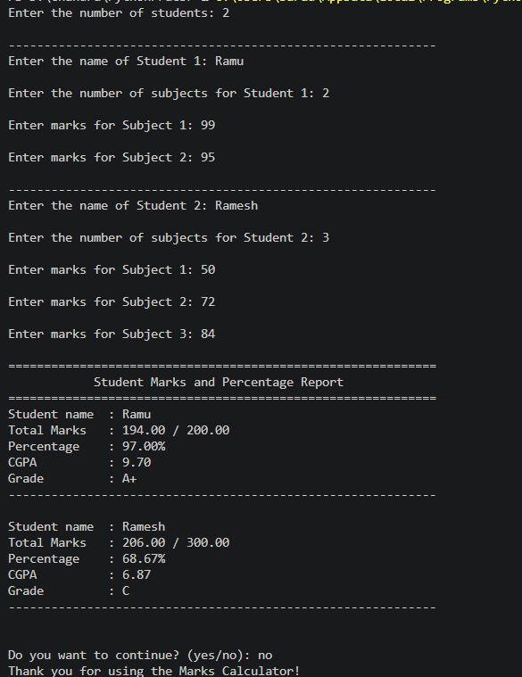

# 📚 Student Marks Calculator

<div align="center">

A beginner-friendly Python console application for calculating **Total Marks**, **Percentage**, **CGPA**, and **Grade** for multiple students.

<br>


</div>

---

## 📑 Table of Contents

* [About](#-about)
* [Features](#-features)
* [Sample Output](#-sample-output)
* [Technologies Used](#-technologies-used)
* [Project Structure](#-project-structure)
* [Getting Started](#-getting-started)
* [Concepts Practiced](#-concepts-practiced)
* [Grade Criteria](#-grade-criteria)
* [Future Improvements](#-future-improvements)
* [License](#-license)

---

## 📖 About

The **Student Marks Calculator** is a command-line Python application that collects marks for multiple students and generates a report showing:

* 📊 Total Marks
* 📈 Percentage
* 🎓 CGPA
* 🏆 Grade

The project was built while learning Python fundamentals and focuses on writing clean, readable, and well-structured code.

---

## ✨ Features

* 👨‍🎓 Supports multiple students
* 📚 Supports different numbers of subjects for each student
* 📝 Automatic total marks calculation
* 📈 Percentage calculation
* 🎯 CGPA calculation
* 🏅 Grade assignment
* 📄 Neatly formatted report card
* 🔄 Continue/Exit option

---

## 🖼️ Screenshot



---

## 🚀 Technologies Used

| Technology  | Purpose                 |
| ----------- | ----------------------- |
| 🐍 Python 3 | Programming Language    |
| 💻 VS Code  | Development Environment |

---

## 📂 Project Structure

```text
Student-Marks-Calculator/
│
├── student_marks_calculator.py
├── README.md
├── LICENSE
└── .gitignore
└── Images
  └── Output.png
```

---

## ⚙️ Getting Started

### Clone the repository

```bash
git clone https://github.com/your-username/student-marks-calculator.git
```

### Navigate to the project directory

```bash
cd student-marks-calculator
```

### Run the application

```bash
python student_marks_calculator.py
```

---

## 🧠 Concepts Practiced

This project helped reinforce the following Python concepts:

* Variables
* User Input
* Lists
* Nested Loops
* Conditional Statements
* Arithmetic Operations
* String Formatting (`f-strings`)
* `sum()` Function
* `while` Loops
* Program Flow Control

---

## 📊 Grade Criteria

| CGPA       | Grade |
| ---------- | ----- |
| 9.0 – 10.0 | A+    |
| 8.0 – 8.99 | A     |
| 7.0 – 7.99 | B     |
| 6.0 – 6.99 | C     |
| 5.0 – 5.99 | D     |
| Below 5.0  | F     |

---

## 🎯 Future Improvements

* [ ] Input validation
* [ ] Student ranking system
* [ ] Highest scorer detection
* [ ] Class average calculation
* [ ] Save reports to a text file
* [ ] Export reports as CSV
* [ ] Dictionary-based student records
* [ ] GUI version using Tkinter
* [ ] Database integration (SQLite)

---

## 🤝 Contributing

Contributions are welcome!

If you have ideas to improve this project:

1. Fork the repository.
2. Create a new feature branch.
3. Commit your changes.
4. Open a Pull Request.

---

## 📜 License

This project is licensed under the **MIT License**.

---

## 👨‍💻 Author

**T.Sri Chandra**

* GitHub: https://github.com/srichandratech-del

---

<div align="center">

### ⭐ If you found this project useful, consider giving it a Star!

Made with ❤️ while learning Python.

</div>
